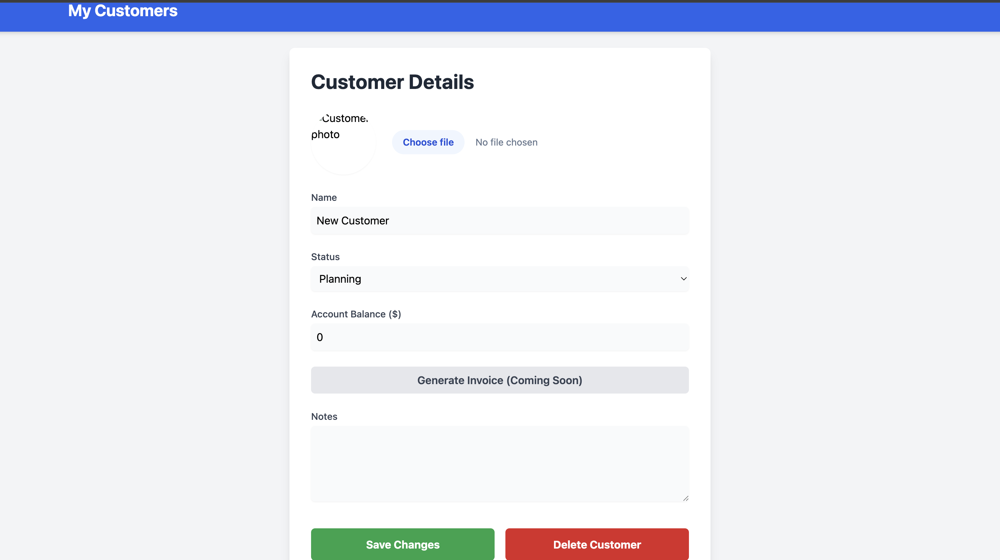

# CRM Dynamic Website — Kanban Customer Manager

A dynamic, multi-page customer management tool built on a Kanban 
board format — designed to track customer or ticket status across 
stages in real time.

---

## What This Is

The goal was to build a dynamic web application — not a static 
page — that could serve different real-world workflows depending 
on how it's configured. A few examples of what this can power:

- Customer support ticket tracking — move tickets from raised 
  to in-progress to resolved
- Client project management — track where each client engagement 
  stands across stages
- Sales pipeline management — move leads through Planning, 
  In-progress, Review, and Complete
- Any workflow where something has a status that changes over time

The Kanban format makes the status visible at a glance and 
drag-and-drop makes updating it instant.

---

## Demo

<video src="images/Kanban-Powered Customer Manager Tool.mp4" 
width="600" controls></video>

[▶ Watch Demo Video](images/Kanban-Powered%20Customer%20Manager%20Tool.mp4)

---

## How It Works

**The board**
Three columns — Planning, In-progress, and Review. Each customer 
or ticket appears as a card showing their photo, name, and account 
balance. Cards are draggable across columns and the status updates 
in the database the moment a card is moved.

Customers marked as Complete drop off the board automatically — 
they're still in the database but the active board stays clean.

**The customer detail page**

Each card links to a detail page where you can edit all fields — 
name, status, account balance, notes — upload a new photo, 
generate an invoice placeholder, or delete the customer entirely.

---

## Architecture

**Frontend**
HTML, Tailwind CSS, vanilla JavaScript — two pages, no framework.

**Backend — Firebase**
All backend services run on Firebase:

- Firestore — primary database storing all customer records in 
  real time. Each document holds name, status, balance, notes, 
  and a photo URL.
- Cloud Storage — stores uploaded customer photos. The public 
  URL is saved back to Firestore and rendered on the card.
- Firebase Hosting — serves the web application.

Data is read and written in real time — no page refresh needed 
when status changes or customer details are updated.

---

## Tech Stack

Gemini CLI — used to generate the application code  
Firebase Firestore — real-time database  
Firebase Cloud Storage — photo storage  
Firebase Hosting — deployment  
Tailwind CSS — frontend styling  
Vanilla JavaScript — client-side logic  
HTML — page structure  

---

## Built With

This project was built using Gemini CLI to generate the initial 
codebase, followed by debugging, Firebase configuration, and 
iterative fixes to get to a fully working deployed product. 
The prompt used was structured at PRD-level detail — defining 
the architecture, data model, and functionality upfront.

---

## Related

🔗 [LinkedIn post about this project](https://www.linkedin.com/posts/007sk_i-used-an-entire-prd-as-a-single-prompt-ugcPost-7463992307869028352-b5w-/?utm_source=share&utm_medium=member_desktop&rcm=ACoAACWq99EBOK4merjE7Me8UTP41JSokBgHiVU)
